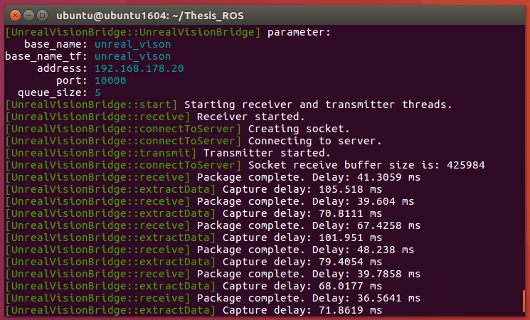
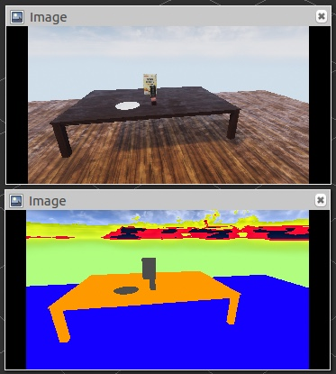
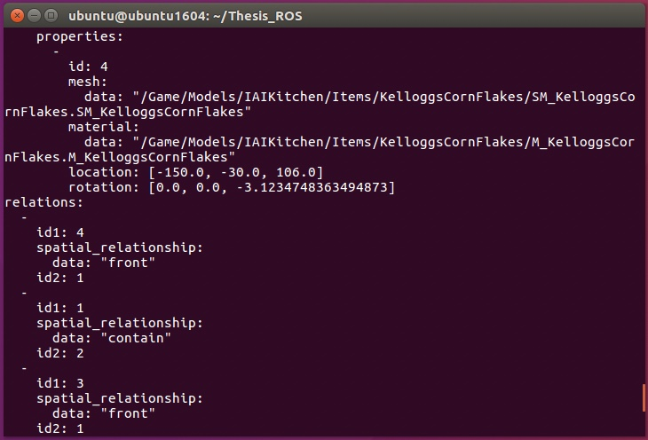

# Bridge-For-AutonomousRGBDCamera

An Unreal Engine to ROS bridge for [AutonomousRGBDCamera](https://github.com/mschaecke/AutonomousRGBDCamera). Both RGB-D and annotation data are extracted and published as ROS topics.

A thesis elaborating the project can be requested at the [Faculty of Mathematics and Computer Science](https://www.uni-bremen.de/en/open-campus/program/tents/faculty-3-mathematics-and-computer-science) at the [University of Bremen](https://www.uni-bremen.de/en/). It includes the theoretical background, architecture and evaluation.

# Demonstration

The bridge successfully connects to the server and receives packages:

Color and object mask images originally captured in Unreal Engine in RViz:

Annotation data corresponding to the images:

# Usage

* Run Unreal Engine and press the "Play" button.
* Open a terminal in the correct folder (e.g MyProject/Bridge-For-AutonomousRGBDCamera).
* Use the following terminal commands:
  * `catkin build`
  * `roscore`
  * `source devel/setup.bash`
  * `roslaunch unreal_vision_bridge unreal_vision_bridge.launch address:=192.168.178.20` (ensure the IP address is correct)
  * `rostopic echo <path to topic>`
* Access the data via ROS topics.

# Credits

Based on the [unreal_vision_bridge](https://github.com/sherpa-eu/unreal_vision_bridge) project.
